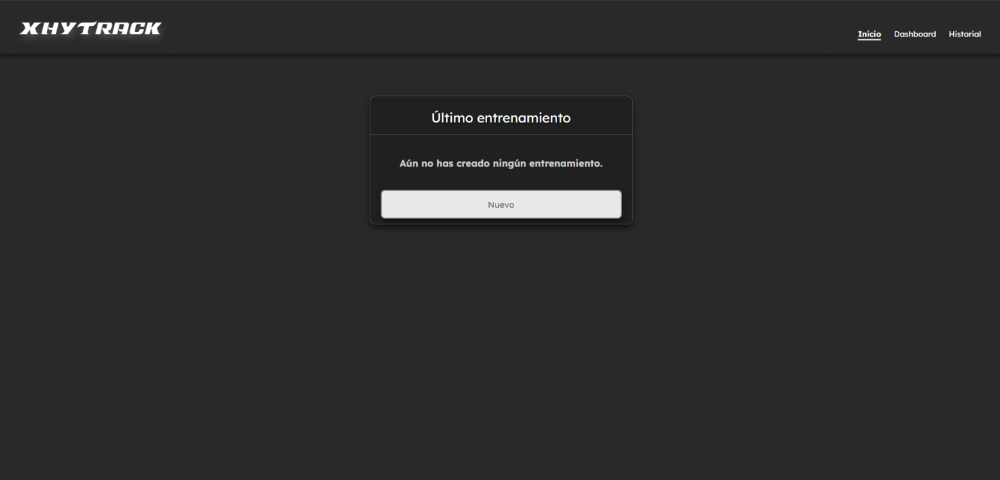
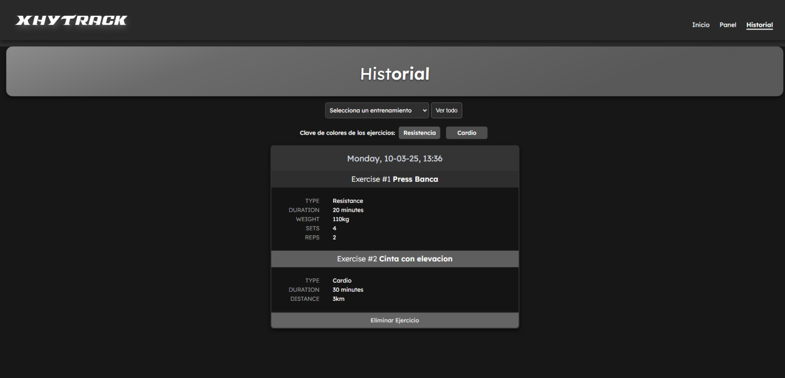
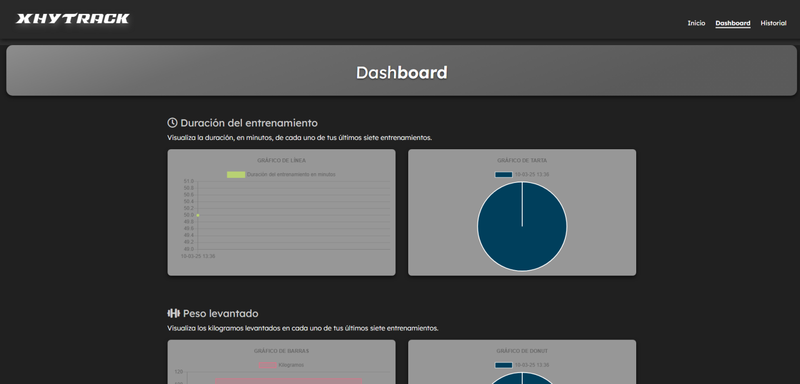

# XhyTrack

## Descripción
*XhyTrack* es una aplicación full-stack responsiva diseñada para ayudar a las personas a llevar un control de sus entrenamientos. En la página de inicio, los usuarios pueden elegir agregar ejercicios al último entrenamiento realizado (si existe) o crear un nuevo entrenamiento al que agregar ejercicios. Además, los usuarios pueden ver las estadísticas de sus últimos siete entrenamientos en la página de Dashboard, y consultar todo su historial de entrenamientos en la página de historial.


## Instrucciones
1. En la página de inicio, elige si deseas agregar un ejercicio al último entrenamiento o crear un nuevo entrenamiento.
2. En la página de ejercicios, selecciona si vas a agregar un ejercicio de resistencia o de cardio y completa los detalles requeridos.
3. Después de ingresar los detalles del ejercicio, puedes optar por agregar otro ejercicio al entrenamiento o finalizarlo y regresar a la página de inicio.
4. Accede a la página 'Dashboard' para ver las estadísticas de los últimos siete entrenamientos.
5. Accede a la página 'Historial de Entrenamientos' para ver o eliminar entrenamientos anteriores.


## Instalación
1. En la página de inicio, elige si deseas agregar un ejercicio al último entrenamiento o crear un nuevo entrenamiento.
2. En la página de ejercicios, selecciona si vas a agregar un ejercicio de resistencia o de cardio y completa los detalles requeridos.
3. Después de ingresar los detalles del ejercicio, puedes optar por agregar otro ejercicio al entrenamiento o finalizarlo y regresar a la página de inicio.
4. Accede a la página 'Dashboard' para ver las estadísticas de los últimos siete entrenamientos.
5. Accede a la página 'Historial de Entrenamientos' para ver o eliminar entrenamientos anteriores.

1.- Uso del Script 

```
git clone https://github.com/xhryzz/XhyTrack.git
```

```
npm install express
```
```
node server.js
```


## Mis redes y mis cosas ;)

[Página Web](https://xhryzz.github.io/web/)

[Instagram](https://www.instagram.com/chriismartinezz/)

[PayPal](http://paypal.com/paypalme/chriismartinezz)


## Capturas de Pantalla









Si tienes alguna pregunta adicional, no dudes en hablarme [web]https://xhryzz.github.io/web).
