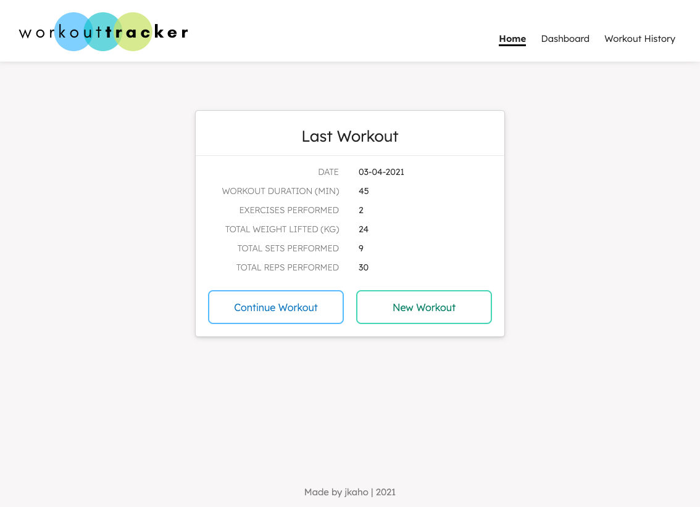
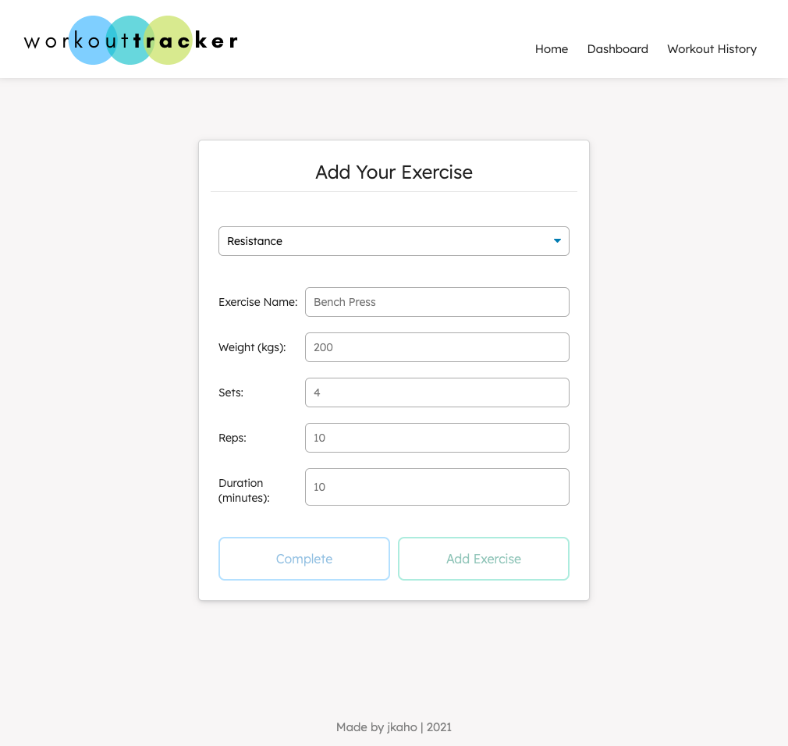
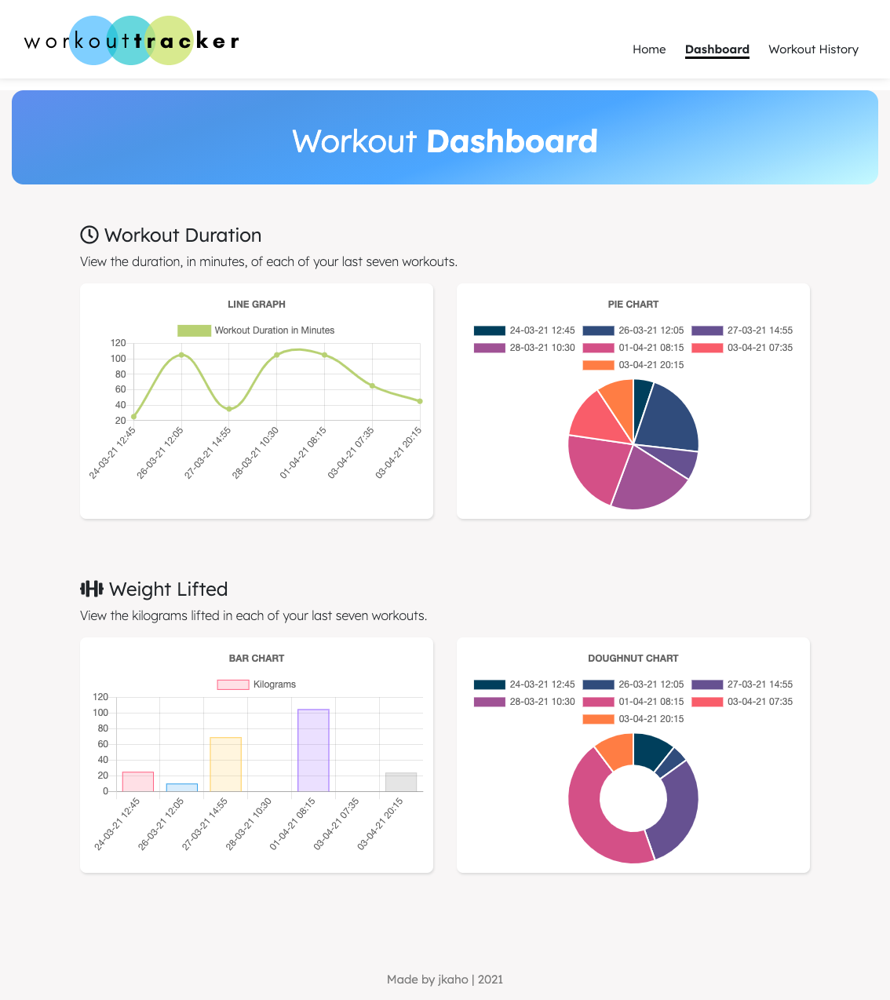
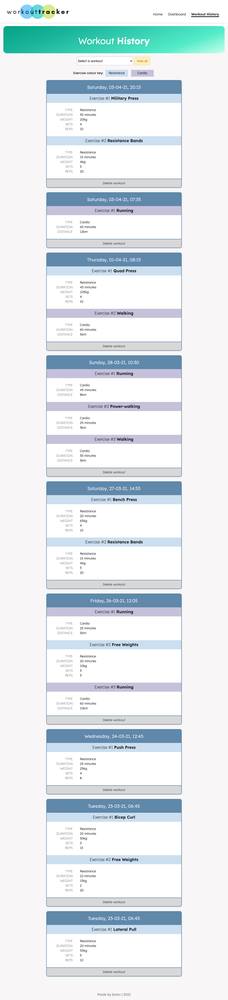

# XhyTrack - Tracker de Entrenamientos

## Descripción
*XhyTrack* es una aplicación full-stack responsiva diseñada para ayudar a las personas a llevar un control de sus entrenamientos. En la página de inicio, los usuarios pueden elegir agregar ejercicios al último entrenamiento realizado (si existe) o crear un nuevo entrenamiento al que agregar ejercicios. Además, los usuarios pueden ver las estadísticas de sus últimos siete entrenamientos en la página de panel de control, y consultar todo su historial de entrenamientos en la página de historial.

## Tabla de Contenidos
- [Instrucciones](#Instrucciones)
- [Desarrollo](#Desarrollo)
- [Tecnologías Utilizadas](#Tecnologías-Utilizadas)
- [Capturas de Pantalla](#Capturas-de-Pantalla)
- [Enlace a la App Desplegada](#Enlace)
- [Preguntas](#Preguntas)

## Instrucciones
1. En la página de inicio, elige si deseas agregar un ejercicio al último entrenamiento o crear un nuevo entrenamiento.
2. En la página de ejercicios, selecciona si vas a agregar un ejercicio de resistencia o de cardio y completa los detalles requeridos.
3. Después de ingresar los detalles del ejercicio, puedes optar por agregar otro ejercicio al entrenamiento o finalizarlo y regresar a la página de inicio.
4. Accede a la página 'Panel de Control' para ver las estadísticas de los últimos siete entrenamientos.
5. Accede a la página 'Historial de Entrenamientos' para ver o eliminar entrenamientos anteriores.

## Desarrollo
El objetivo principal de este proyecto fue construir el backend para la interfaz de usuario existente. Algunas de las características adicionales que se agregaron al frontend incluyen:
- Página de historial de entrenamientos
- Funcionalidad para eliminar entrenamientos
- Corrección de etiquetas incorrectas en los gráficos de la página del panel de control
- Cambios generales de estilo en todas las páginas
- Diseño responsivo

## Tecnologías Utilizadas
- Node.js
- Express
- JavaScript
- MongoDB / MongoDB Atlas
- Mongoose 
- Robo 3T
- nodemon 
- Chart.js
- HTML
- CSS
- Google Fonts
- Font Awesome
- Canva

## Capturas de Pantalla

### Página de Inicio

### Página de Ejercicio

### Página de Panel de Control de Entrenamientos

### Página de Historial de Entrenamientos

Si tienes alguna pregunta adicional, no dudes en hablarme [web]https://xhryzz.github.io/web).
